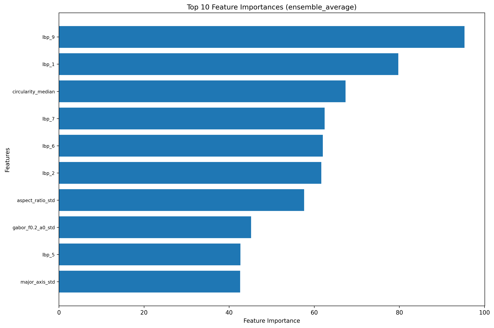

# Morphological Feature Analysis of Retinal Pigment Epithelial Cells from C57BL/6J Mice during Aging

*Department of Mathematics and Statistics, College of Arts and Sciences, Georgia State University*  
*Department of Ophthalmology, Emory University*

## 1. Abstract

A configuration-driven Python application for extracting, aggregating, and analyzing morphological features from Retinal Pigment Epithelium (RPE) image crops. The pipeline produces cleaned feature tables, trains a stacking ensemble classifier (XGBoost + LightGBM + CatBoost), performs feature importance analysis, and generates reproducible model artifacts.

## 2. Introduction

**Input**: Labeled folders of TIFF image crops (per-image) or precomputed feature CSVs.  
**Pipeline**: 7-step automated workflow (extraction → cleaning → CSV loading → training → artifacts → feature importance → violin plots).  
**Features**: 133+ morphological features including shape, intensity stats, texture (LBP, GLCM, Gabor), nuclear features, and spatial measures.  
**Processing**: Aggregates per-region measurements into per-image summaries (count, mean, median, std, min, max).  
**Modeling**: Cleans data (inf→NaN), drops columns with excessive missingness, imputes (median), scales, trains a stacking ensemble (XGBoost + LightGBM + CatBoost with LogisticRegression meta-learner), extracts feature importances, and generates advanced feature insights.  
**Outputs**: Cleaned/raw features CSV, confusion matrix, JSON classification report, feature importance CSV and plot, feature insights plots, and saved model bundle for reproducible prediction.

The codebase is written in clean, maintainable Python following PEP 8 standards, with comprehensive docstrings, type hints, and robust error handling.

## 3. Methodology

### 3.1. Pipeline Overview

The automated pipeline consists of 7 steps:

1. **Feature Extraction**: Extracts morphological, texture, and intensity features from TIFF images using configurable parameters.
2. **Clean & Prepare**: Cleans data, handles missing values, imputes, scales, and saves cleaned CSV.
3. **Load Cleaned Data**: Loads the cleaned CSV to ensure consistency for all modeling steps.
4. **Model Training**: Trains stacking ensemble classifier with cross-validation.
5. **Save Artifacts**: Saves model bundle, preprocessing objects, reports, and plots.
6. **Feature Importance**: Extracts and visualizes top feature importances from the trained ensemble model.
7. **Feature Insights**: Creates violin plots with trendlines for top N features across age groups.

### 3.2. Feature Engineering

The pipeline processes valid image crops to extract **133+ features** per image, categorized into five groups. This robust feature set captures the comprehensive morphological profile of the RPE cells.

#### 3.2.1. Morphological (Shape) Features

These features describe the geometry and shape of individual cells, aggregated at the image level (mean, median, std, min, max, count).

- **Area & Perimeter**: Size and boundary length of the cell.
- **Major & Minor Axis**: Length of the primary and secondary axes of the fitted ellipse.
- **Aspect Ratio**: Ratio of major to minor axis (elongation).
- **Eccentricity**: Deviation from a perfect circle (0 = circle, 1 = line).
- **Solidity**: Ratio of the region area to the convex hull area (measures convexity/smoothness).
- **Circularity**: Measure of how close the shape is to a perfect circle ($4\pi \times Area / Perimeter^2$).
- **Cell Count & Density**: Total number of cells and cells per unit area.

#### 3.2.2. Intensity (Pixel) Statistics

Global statistics derived from the grayscale pixel intensity values, reflecting overall brightness and variation.

- **Mean & Std**: Average brightness and contrast.
- **Skewness**: Asymmetry of the intensity distribution.
- **Kurtosis**: Tail heaviness of the intensity distribution.

#### 3.2.3. Texture Analysis

Advanced texture descriptors to capture micro-patterns and surface details.

- **Local Binary Patterns (LBP)**: Captures local texture patterns by comparing each pixel with its neighbors.
- **Gray-Level Co-occurrence Matrix (GLCM)**: Measures texture based on the spatial relationship of pixels.
  - *Contrast, Dissimilarity, Homogeneity, Energy, Correlation, ASM*.
- **Gabor Filters**: Captures specific frequency and orientation content ($0^\circ, 45^\circ, 90^\circ$ at multiple frequencies).

#### 3.2.4. Nuclear Features

(Optional) Detailed metrics for the nucleus (red channel) relative to the cell body.

- **Nuclear Area, Perimeter, Axes**: Geometry of the nucleus.
- **Nuclear Circularity & Solidity**: Shape regularity of the nucleus.
- **N/C Ratio (Nucleus-to-Cytoplasm Ratio)**: Ratio of nuclear area to cytoplasmic area, a key indicator of cell health and aging.

#### 3.2.5. Spatial Distribution

Measures the organization and spacing of cells.

- **Nearest Neighbor Distance (Mean/Std)**: Average distance to the nearest neighboring cell, indicating clustering or regularity.

### 3.3. Computational Framework

#### 3.3.1. Project Structure

```text
Morphological-Feature-Analysis-of-Retinal-Pigment-Epithelial-Cells-from-C57BL-6J-Mice-During-Aging/
├── .git/                          # Git repository
├── .gitignore                     # Git ignore patterns
├── analysis_results/              # Generated outputs (reports/, models/, plots/)
├── config.json                    # Runtime configuration file
├── main.py                        # Main entrypoint script
├── README.md                      # This documentation
├── requirements.txt               # Python dependencies
└── scripts/                       # Modular analysis scripts
    ├── directories.py             # Directory management utilities
    ├── clean_and_prepare.py       # Data cleaning and preprocessing
    ├── feature_extraction.py      # Feature extraction from images
    ├── feature_insights.py        # Feature importance and visualization
    ├── load_model_bundle_and_predict.py  # Prediction on new data
    ├── timer.py                   # Performance timing utilities
    ├── train_and_save_pipeline.py # Model training and artifact saving
    └── visualize_channels.py      # Image channel visualization
```

#### 3.3.2. Files and Scripts

- `main.py` — **Main entrypoint**. Orchestrates the complete 7-step pipeline.
- `config.json` — Runtime configuration (paths, feature params, analysis params).
- `requirements.txt` — Python dependencies.
- `scripts/` — Modular scripts for specific functionality:
  - `directories.py` — Directory management utilities.
  - `clean_and_prepare.py` — Feature cleaning and preprocessing pipeline.
  - `feature_extraction.py` — Feature extraction from TIFF images.
  - `feature_insights.py` — Feature importance extraction and violin plot generation with trendlines.
  - `train_and_save_pipeline.py` — Model training, artifact saving, and classification reports.
  - `load_model_bundle_and_predict.py` — Prediction on new data using saved models.
  - `timer.py` — Timing utilities for performance measurement.
  - `visualize_channels.py` — Channel visualization utilities.

All scripts follow PEP 8 standards with type hints, comprehensive docstrings, and robust error handling.

## 4. Experimental Results

### 4.1. Key Analysis Findings

#### 4.1.1. Feature Importance Analysis

The analysis highlights the significant role of texture and shape features in classifying RPE cells. The top features are dominated by **Local Binary Patterns (LBP)**, with `lbp_9` and `lbp_1` being the most influential. **Circularity** (`circularity_median`, `circularity_std`) and **Aspect Ratio** (`aspect_ratio_std`) are also highly important, suggesting that both the textural complexity and the geometric shape of the cells are critical biomarkers for aging.



### 4.2. Classification Results

The stacking ensemble model (XGBoost + LightGBM + CatBoost) achieved valid high performance across all age groups.

#### 4.2.1. Summary Metrics

| Metric                | Score      |
| :-------------------- | :--------- |
| **Accuracy**          | **0.9939** |
| **Weighted F1-Score** | **0.9939** |
| **Macro F1-Score**    | **0.9957** |

#### 4.2.2. Per-Class Performance

| Class (Age Group) | Precision | Recall | F1-Score | Support |
| :---------------- | :-------- | :----- | :------- | :------ |
| **0 - 30 Days**   | 1.00      | 1.00   | 1.00     | 14      |
| **1 - 45 Days**   | 1.00      | 1.00   | 1.00     | 30      |
| **2 - 60 Days**   | 1.00      | 0.98   | 0.99     | 44      |
| **3 - 180 Days**  | 0.99      | 1.00   | 0.99     | 152     |
| **4 - 330 Days**  | 1.00      | 0.98   | 0.99     | 63      |
| **5 - 720 Days**  | 1.00      | 1.00   | 1.00     | 23      |

*Note: Class labels correspond to specific age groups.*

### 4.3. Outputs

(Default Location: `analysis_results/`, Organized into `reports/`, `models/`, and `plots/`)

- **`reports/rpe_extracted_features.csv`** — Raw extracted features (one row per image).
- **`reports/rpe_extracted_features_cleaned.csv`** — Cleaned + scaled features.
- **`plots/confusion_matrix.png`** — Confusion matrix for classifier predictions.
- **`reports/classification_report.json`** — Classification metrics from cross-validated predictions.
- **`reports/feature_importances.csv`** — Feature importances from the ensemble model.
- **`plots/feature_importances.png`** — Bar plot of top N feature importances.
- **`plots/top_features_violin_plots.png`** — Violin plots with trendlines comparing distributions of top features across age groups.
- **`models/model.joblib`**, **`models/preprocessor.joblib`** — Saved model and preprocessing artifacts.

## 5. Reproducibility & Usage

### 5.1. Installation

1. From the project folder, create and activate a virtual environment and install dependencies:

```bash
python3 -m venv .venv
source .venv/bin/activate
pip install -r requirements.txt
# For macOS users with Apple Silicon (M1/M2/M3), you may need OpenMP:
brew install libomp
```

#### 5.1.1. Development Setup

For development, install pre-commit hooks to ensure code quality:

```bash
pip install pre-commit
pre-commit install
```

This will run Black code formatting on commits.

### 5.2. Training the Model (Full Pipeline)

1. Edit `config.json` to set `paths.image_directory`, `paths.output_directory`, and any feature or analysis parameters.
2. Run the full pipeline (extract features -> clean -> train -> save):

```bash
python3 -u main.py -c config.json -v
```

This will run the complete 7-step pipeline and save the trained model to `analysis_results/models/`.

### 5.3. Predicting on New Data (No Training)

Use these commands to run predictions using your **already trained model**. These steps do **not** re-train the model.

#### 5.3.1. Predicting from a Features CSV

If you already have a CSV file containing features (e.g., `new_data.csv`):

```bash
PYTHONPATH=. python3 scripts/load_model_bundle_and_predict.py --features "new_data.csv" --out "new_predictions.csv"
```

*Note: The script automatically handles data cleaning and scaling using the parameters saved from your training run.*

#### 5.3.2. Predicting from Raw Images

If you have a folder of new images to analyze:

1. **Extract Features from Images**:

    ```bash
    python3 -c "from scripts.feature_extraction import extract_features_from_directory; import json; config=json.load(open('config.json')); extract_features_from_directory('PATH_TO_NEW_IMAGES', config).to_csv('new_features.csv', index=False)"
    ```

    *(Replace `PATH_TO_NEW_IMAGES` with the path to your image folder).*

2. **Generate Predictions**:

    ```bash
    PYTHONPATH=. python3 scripts/load_model_bundle_and_predict.py --features "new_features.csv" --out "new_predictions.csv"
    ```

### 5.4. Configuration

All runtime parameters are in `config.json` next to `main.py`. Key configuration sections:

- **`paths`**:
  - `image_directory` — Folder of labeled subfolders containing TIFF crops.
  - `output_directory` — Where CSVs, plots, and models are written.
  - `output_features_csv` — Optional path for the extracted features CSV.
- **`analysis_params`**:
  - `cv_folds` — Number of cross-validation folds (default: 5).
  - `random_state` — Random seed for reproducibility (default: 42).
  - `max_nan_fraction` — Maximum allowed NaN fraction for columns before dropping (default: 0.5).
  - `test_size` — Train/test split ratio (default: 0.2).
  - `impute_strategy` — Imputation method (default: "median").
  - `rf_params` — RandomForest parameters (n_estimators, max_depth).
  - `target_column` — Name of target column (default: "label").
- **`feature_params`**:
  - `lbp_points`, `lbp_radius` — Local Binary Pattern parameters.
  - `glcm_levels` — GLCM quantization levels.
  - `gabor_frequencies`, `gabor_angles` — Gabor filter parameters.
  - `use_otsu` — Whether to use Otsu thresholding (default: true).
  - Channel thresholds for segmentation.
- **`feature_insights_params`**:
  - `top_features_count` — Number of top features to analyze (default: 10).

Modify these values to tune extraction and modeling without editing code.

### 5.4. Troubleshooting & Tips

- **Dependencies**: The project requires XGBoost, LightGBM, and CatBoost. On some systems, you may need to install these separately:

  ```powershell
  pip install xgboost lightgbm catboost
  ```

- **Error Handling**: The code includes robust error handling for file I/O, image processing, and data operations.
- **Configuration**: Ensure `paths.image_directory` points to the correct folder with readable TIFF files.
- **Data Quality**: If many columns are dropped, lower `analysis_params.max_nan_fraction` or inspect the features CSV for missing values.
- **Memory Usage**: For large image datasets, consider reducing `feature_params.glcm_levels` or `gabor_frequencies` arrays.
- **Model Training**: The stacking ensemble uses 5-fold cross-validation by default. Adjust `cv_folds` for faster training or more robust validation.
- **Code Quality**: All scripts follow PEP 8 with type hints and docstrings for maintainability.

## 6. Acknowledgements

A heartfelt thank you to Dr. Yi Jiang for her tutelage. Our deepest gratitude to the Center for the Advancement of Students and Alumni (CASA), the Research Initiation in Mathematics, Mathematics Education, and Statistics Program (RIMMES), and the Honors College at Perimeter College. RPE flat-mount images were provided by Emory University, Department of Ophthalmology.

## 7. References

[1] Bhatia, S. K., A. Rashid, M. A. Chrenek, Q. Zhang, B. B. Bruce, M. Klein, J. H. Boatright, Y. Jiang, H. E. Grossniklaus, and J. M. Nickerson. 2016. “Analysis of RPE Morphometry in Human Eyes.” Molecular Vision 22 (July): 898–916.

[2] Kim, Y.-K., H. Yu, V. R. Summers, K. J. Donaldson, S. Ferdous, D. Shelton, N. Zhang, et al. 2021. “Morphometric Analysis of Retinal Pigment Epithelial Cells From C57BL/6J Mice During Aging.” Investigative Ophthalmology & Visual Science 62 (2): 32. [https://doi.org/10.1167/iovs.62.2.32](https://doi.org/10.1167/iovs.62.2.32)

[3] Rashid, A., S. K. Bhatia, K. I. Mazzitello, M. A. Chrenek, Q. Zhang, J. H. Boatright, H. E. Grossniklaus, Y. Jiang, and J. M. Nickerson. 2016. “RPE Cell and Sheet Properties in Normal and Diseased Eyes.” Advances in Experimental Medicine and Biology 854: 757–63. [https://doi.org/10.1007/978-3-319-17121-0_101](https://doi.org/10.1007/978-3-319-17121-0_101)

[4] Yang, S., J. Zhou, and D. Li. 2021. “Functions and Diseases of the Retinal Pigment Epithelium.” Frontiers in Pharmacology 12 (July 28): 727870. [https://doi.org/10.3389/fphar.2021.727870](https://doi.org/10.3389/fphar.2021.727870)

## 8. License

MIT

---
**Version**: 1.0.0  
**Last Updated**: November 12, 2025
